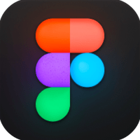
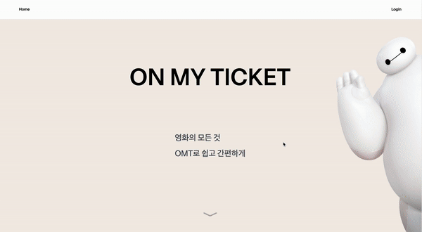
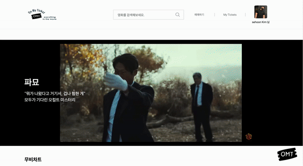
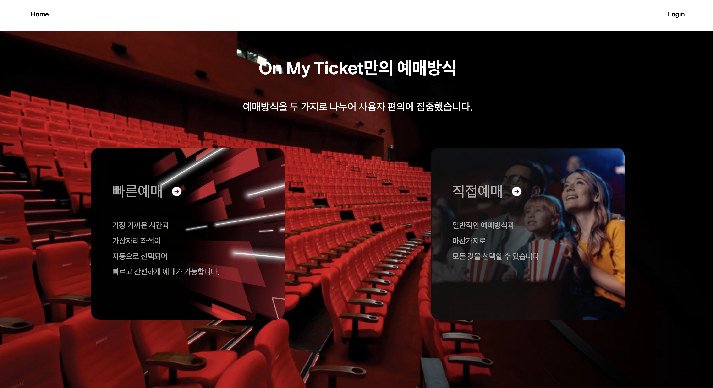
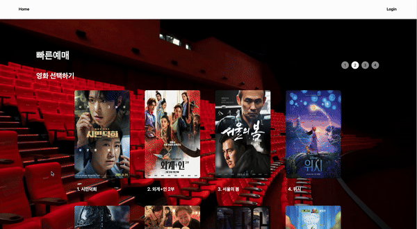
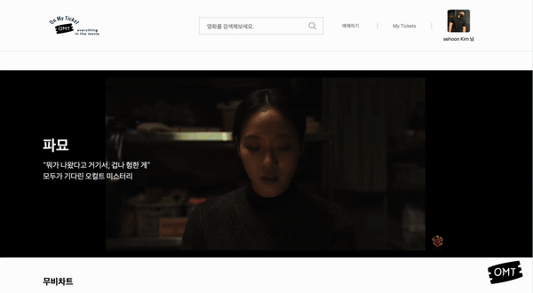
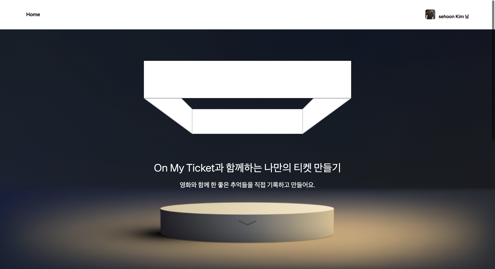
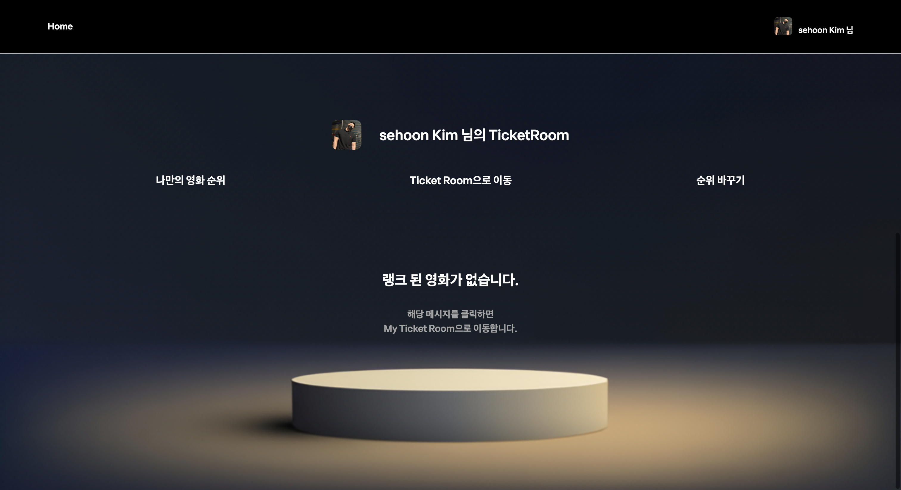
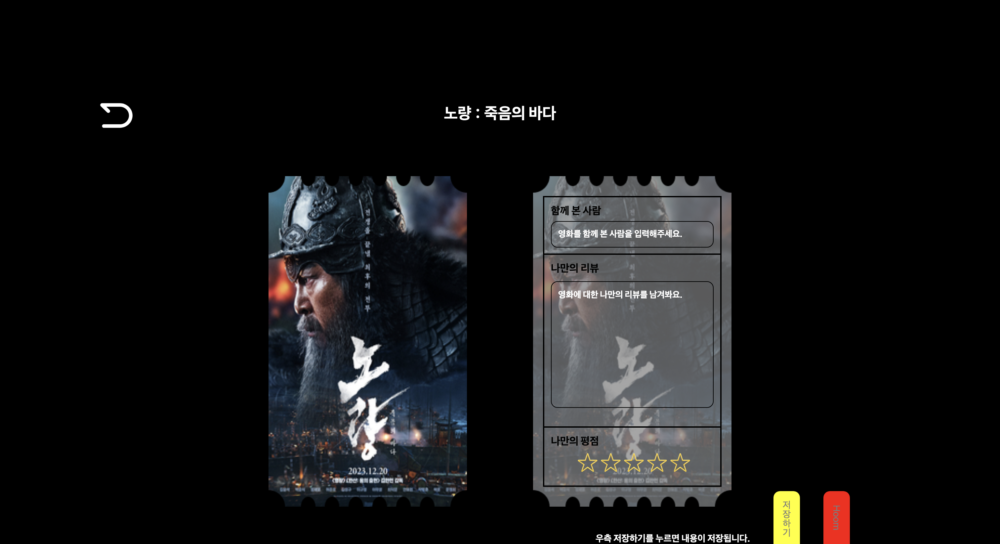

 

  

- **`프로젝트 명` :** OnMyTicket [ OMT ]

- **`프로젝트 기간` :** 2023.09.02 - 2024.01.26

- **`한줄 소개` :** OnMyTicket - 대표 영화관 3사의 예매기능의 통합, 나만의 티켓을 통한 유저의 컬렉션을 모을 수 있는 웹 페이지

- **`팀원` :** 김세훈 (팀장), 김지열

- **`배포 링크` :** [🌐 OnMYTicket ](https://omt-onmyticket.vercel.app/)

- **`작업 깃허브 링크` :** [ OMT ](https://github.com/OMT-OnMyTicket/OMT)

- **`사용자 요구사항 정의서`:** [사용자요구사항 정의서](https://docs.google.com/spreadsheets/d/1VlqhETC1om6duJ2IAhafjqzjnjXuem83h4loEhI-Uqc/edit#gid=0)

- **`테이블 명세서`:** [테이블 명세서](https://docs.google.com/spreadsheets/d/1ERTUD86rGCYTPDTLLCHrb4GBEBrCmKRUJdhToXBn89I/edit#gid=0)

- **`API 명세서`:** [API 명세서](https://documenter.getpostman.com/view/24688585/2s9YJXZk52#29253473-b2f2-4ddc-be3a-f04c66b51ca2)

 

### 💼 Team

|                                                                                                                                                                                                                                                                                                                                                                                                                     김세훈 (FE)                                                                                                                                                                                                                                                                                                                                                                                                                     |                                                                                                                                        김지열 (BE)                                                                                                                                         |
| :-----------------------------------------------------------------------------------------------------------------------------------------------------------------------------------------------------------------------------------------------------------------------------------------------------------------------------------------------------------------------------------------------------------------------------------------------------------------------------------------------------------------------------------------------------------------------------------------------------------------------------------------------------------------------------------------------------------------------------------------------------------------------------------------------------------------------------------------------------: | :-------------------------------------------------------------------------------------------------------------------------------------------------------------------------------------------------------------------------------------------------------------------------------------------: |
|                                                                                                                                                                                                                                                                                                                                                                                                                                                                                                                                                                                                                                                                                                                            |                                                                                                                                                                  |
| - **Front의 모든 파트**  - **Introduction Page** - AOS & CSS 적극 활용  - **Main Page** - 검색 ,영화 예고편 , 무비차트, 각종 정보등  다양한 기능 제공 - Youtube, KMDB, KOPIC등 API 적극 활용  - **Ticketing Page** - 빠른 예매와 직접 예매 - **빠른예매 Page** - KaKao Map Api 활용 - 유저 선택지 최소화 - Loding을 이용한 데이터 선별 - **직접예매 Page** - 실제 예매와 같은 좌석, 시간 선택 - 유저의 모든 선택 권한제공 - **결제 Page** - TossPayments Api 활용  - **Search Page** - 키워드 연관 단어, 자동완성 - 영화 정보 제공 - 나만의 티켓 추가 기능 제공  - **My ticket Page** - 나만의 티켓 제공 (오리지널 티켓) - 함께 시청한 사람, 나만의 리뷰, 별점 기능 - 나만의 영화 순위 기능   | - **Back의 모든 파트** Restful Api  Spring Security -Jwt & OAuth2(google) -XSS Filter  CRUD -Users -Movie -Theater  with QueryDsl 쿼리 튜닝  AWS -Deployment : Github Action & CodeDeploy , S3 -Route 53, Rds(MySQL)  Test : JUnit5   |

 

###  ⚙️ **Tools** 

|                                            Github                                             |                                                                   Discord                                                                    |                                                Notion                                                |
| :-------------------------------------------------------------------------------------------: | :------------------------------------------------------------------------------------------------------------------------------------------: | :--------------------------------------------------------------------------------------------------: |
|  |  |  |

 

#### 🖥 **Front-end**

Main Stack / Sub Stack

|                                                  Html                                                   |                                                        CSS                                                        |                                 TypeScript                                  |                                          NextJS                                           |                                          Figma                                           |
| :-----------------------------------------------------------------------------------------------------: | :---------------------------------------------------------------------------------------------------------------: | :-------------------------------------------------------------------------: | :---------------------------------------------------------------------------------------: | :--------------------------------------------------------------------------------------: |
|  |  |  |  |  |

|                                                                      KaKao Map                                                                       |                             axios                             |                                   Prittier                                   |                                    esLint                                    |
| :--------------------------------------------------------------------------------------------------------------------------------------------------: | :-----------------------------------------------------------: | :--------------------------------------------------------------------------: | :--------------------------------------------------------------------------: |
|  |  |  |  |

 

#### 🔒 **Back-end**

|                                     Java                                      |                                     AWS                                      |                                     mySQL                                      |                                                                        JWT                                                                         |                                         Spring                                          |                                            Spring Boot                                            |
| :---------------------------------------------------------------------------: | :--------------------------------------------------------------------------: | :----------------------------------------------------------------------------: | :------------------------------------------------------------------------------------------------------------------------------------------------: | :-------------------------------------------------------------------------------------: | :-----------------------------------------------------------------------------------------------: |
|  |  |  |  |  |  |

 

 

#### 🌟 Pages & Features

|                                                  소개페이지                                                   |                                         메인페이지                                          |
| :-----------------------------------------------------------------------------------------------------------: | :-----------------------------------------------------------------------------------------: |
|  |  |
|                                                 **예매Home**                                                  |                                        **직접 예매**                                        |
|                    |  |
|                                                 **빠른 예매**                                                 |                                       **검색 페이지**                                       |
|                    |  |
|                                              **MyTicket Intro**                                               |                                      **Ranked Movie**                                       |
|                    |  |
|                                                **TicketRoom**                                                 |                                      **Ticket Review**                                      |
|                    |  |

---
